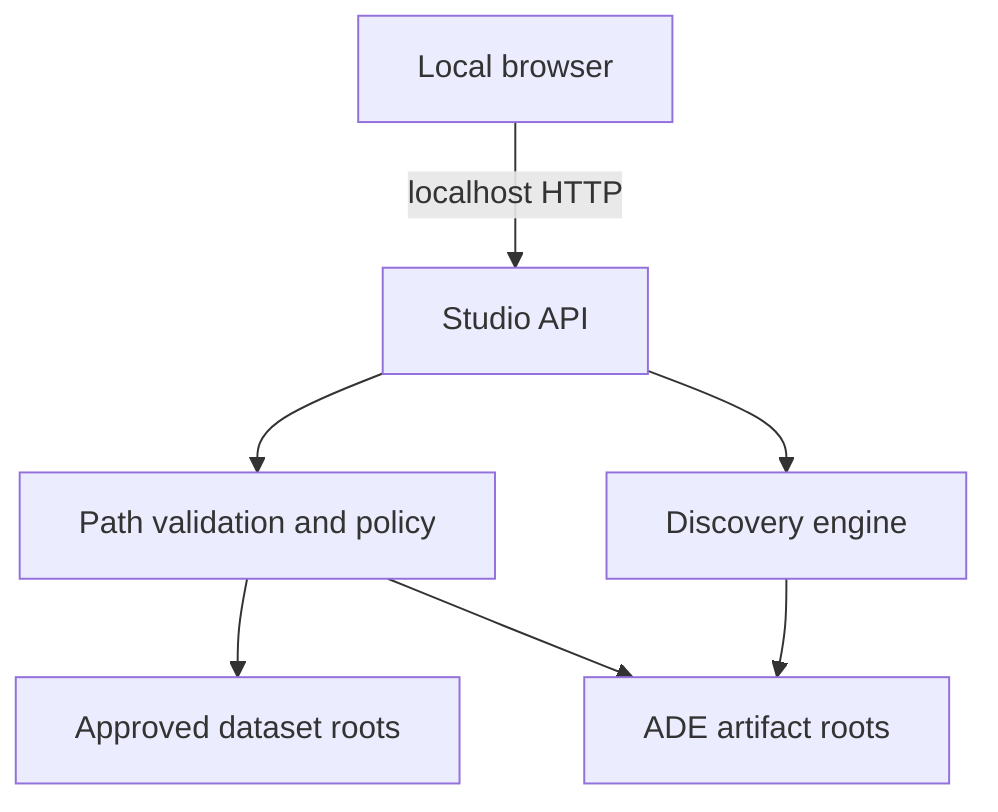

# Security and Access Document

**Version:** 1.0
**Scope:** Local Technical Preview and Local Beta target
**Last revised:** 2026-07-16

## 1. Security Posture

ADE is local-first research software. The current product has no user accounts,
remote tenancy, cloud storage, or internet-facing API. This reduces exposure but
does not make local dataset handling automatically safe. Input files, generated
previews, reports, reviewer notes, dependency execution, and localhost services
remain security-sensitive.

## 2. Assets

- Source datasets and derived previews.
- Reports, run manifests, configuration, and reviewer feedback.
- Research models, checkpoints, benchmark results, and experiment metadata.
- Source code, CI credentials, release artifacts, and dependency lockfiles.
- Future identity, workspace, audit, and API credentials.

## 3. Trust Boundaries

The browser is not trusted to choose arbitrary server files. A localhost request
is not proof of authorization. All paths must be resolved and checked by the
server against explicit roots.

## 4. Threat Model

| Threat | Example | Required control |
| --- | --- | --- |
| Path traversal | `../` access through asset or analysis paths | Canonical resolution, allowlisted roots, filename-only asset routes, negative tests |
| Malicious files | Decompression bombs, malformed images/CSV, oversized inputs | Type checks, size/count limits, safe parsers, time/resource bounds |
| Local cross-origin request | Untrusted webpage calls localhost API | Restricted CORS/origin policy, non-simple mutation requests, CSRF-resistant design |
| Artifact disclosure | Reports expose absolute paths or sensitive samples | Redaction modes, relative identifiers, explicit export policy |
| Command injection | User input reaches shell or model loader | No shell interpolation; structured subprocess arguments only when required |
| Dependency compromise | Typosquatted or vulnerable Python/npm package | Lockfiles, review, automated scanning, minimal dependencies, provenance checks |
| Model supply-chain risk | Untrusted checkpoint executes code | Trusted formats, digest pinning, no remote code by default, isolated optional loaders |
| Feedback tampering | Historical reviewer decision rewritten silently | Append-only records, correction events, checksums/audit fields |
| Resource exhaustion | Excessive patches or sequence length | Configurable hard limits, cancellation, quotas in future hosted profile |
| Claim misuse | Candidate output treated as verified conclusion | Persistent human-review labels, limitations, and export disclaimers |

## 5. Current Access Model

The operating-system user running ADE is the sole effective principal. ADE does
not currently implement application authentication or authorization. Local files
inherit OS permissions. The API must bind to loopback unless an explicitly
documented future deployment profile provides authentication and transport
security.

### Future role model

| Role | Intended permissions |
| --- | --- |
| Viewer | Read approved projects, runs, and reports |
| Reviewer | Viewer plus append review decisions |
| Researcher | Create datasets/runs and manage experiment configuration |
| Project administrator | Manage membership, retention, and project policy |
| Platform administrator | Operate infrastructure without implicit dataset-content access |
| Auditor | Read immutable access and decision events |

Default-deny and least privilege apply. Future service accounts and API keys must
be scoped, expiring, hashed at rest, and individually revocable.

## 6. Local Beta Controls

| ID | Control | Verification |
| --- | --- | --- |
| SEC-001 | Bind Studio API to loopback by default. | Startup and integration tests. |
| SEC-002 | Restrict analysis input to configured roots. | Traversal, symlink, and alternate-path tests across supported OSes. |
| SEC-003 | Restrict report assets to the artifact root. | Filename-only lookup and traversal tests. |
| SEC-004 | Apply input size, file count, patch count, and execution limits. | Boundary tests and documented defaults. |
| SEC-005 | Redact secrets and dataset content from logs. | Structured-log tests and manual release review. |
| SEC-006 | Pin and scan Python, npm, and GitHub Actions dependencies. | CI dependency and secret scans. |
| SEC-007 | Emit append-only feedback events with provenance. | Schema and mutation tests. |
| SEC-008 | Record artifact and configuration digests. | Manifest validation. |
| SEC-009 | Maintain an accurate vulnerability-reporting policy. | Release checklist. |
| SEC-010 | Block unsafe model/checkpoint loading defaults. | Optional-backend security tests. |

## 7. Data Handling

- Raw datasets and generated artifacts remain untracked by default.
- Logs contain identifiers and operational metadata, not raw samples.
- Reports may contain sensitive previews; sharing is an explicit user action.
- Temporary files are created with restrictive permissions where supported and
  cleaned predictably.
- No telemetry or external upload is enabled by default.
- Retention and deletion behavior must be documented before shared deployment.

## 8. Secure Development and Release

- Changes use reviewable branches and pull requests.
- CI runs lint, types, tests, contract checks, dependency review, secret scan,
  and build verification.
- Security-sensitive changes require negative tests and named reviewer approval.
- Release artifacts are generated from a clean revision and accompanied by
  checksums and a software bill of materials when distribution begins.
- No SOC 2, ISO 27001, HIPAA, GDPR, or similar compliance claim is made without
  an applicable system, evidence, and formal assessment.

## 9. Incident Handling

For the local preview, preserve the affected revision, configuration, manifest,
and logs; stop sharing affected artifacts; rotate any exposed credentials;
document impact and remediation; add regression tests; and disclose according
to `SECURITY.md`. A future hosted service requires formal severity, notification,
forensics, recovery, and post-incident procedures.
