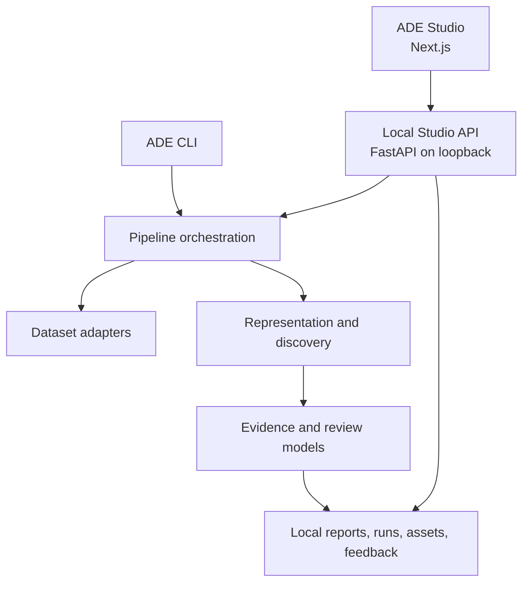

# Technical Architecture Document

**Version:** 1.0
**Status:** Target architecture aligned to current implementation
**Last revised:** 2026-07-16

## 1. Architectural Intent

ADE uses a layered, port-and-adapter architecture so data ingestion, feature
representation, discovery algorithms, evidence generation, reporting, and user
interfaces can evolve independently. The default runtime remains deterministic
and dependency-light. Experimental models are optional plugins evaluated against
the same contracts and benchmark harness.

## 2. Current Runtime Topology

The local filesystem is the Technical Preview persistence boundary. No database,
object store, remote execution plane, or cloud control plane exists.

## 3. Logical Components

| Component | Responsibility | Current state |
| --- | --- | --- |
| Dataset adapters | Validate, profile, and normalize modality-specific input | Image implemented; CSV tabular/time-series foundational; video placeholder |
| Pipeline orchestration | Select workflow, configuration, backends, and artifact destinations | Implemented, with some modality-specific branching |
| Representation backend | Produce deterministic feature vectors | Statistical visual/tabular/time-series features implemented |
| Scoring backend | Produce novelty scores and breakdowns | Centroid/global distance, nearest-neighbor distance, robust z-score/hybrid paths |
| Grouping backend | Group related candidate evidence | Lightweight deterministic grouping |
| Evidence ranker | Select diverse, traceable examples | Implemented for visual workflow |
| Review memory | Summarize prior local reviewer signals | Local JSONL and deterministic annotations |
| Report renderers | Emit Markdown, JSON, and HTML review artifacts | Implemented |
| Studio service | Read artifacts and run local visual analysis | Implemented on localhost |
| Studio frontend | Review-oriented interactive interface | Connected visual workflow; partial feedback and modality coverage |

## 4. Core Contracts

The following boundaries must remain small, typed, and testable:

- `DataAdapter`: `validate`, `profile`, and `load` normalized records.
- `EmbeddingBackend`: transform normalized records into versioned representations.
- `ScoringBackend`: score representations and return component-level evidence.
- `ClusteringBackend`: group candidates without changing source provenance.
- `EvidenceRanker`: select bounded, diverse supporting evidence.
- `ReportRenderer`: render a versioned report model without performing discovery.
- `ArtifactStore`: read/write reports, manifests, assets, run indexes, and review
  records; local filesystem first.
- `SequenceEmbeddingBackend` (planned): accept ordered windows plus masks and
  return time-aware embeddings. This is required before evaluating xLSTM.

## 5. Canonical Data Flow

1. Validate the input path and modality selection.
2. Profile dataset structure and record warnings.
3. Fingerprint the dataset and snapshot effective configuration.
4. Normalize records through the selected adapter.
5. Produce representations with backend identity and version.
6. Score novelty and retain an explainable score breakdown.
7. Select diverse candidates and group related evidence.
8. Produce cautious hypotheses and explicit limitations.
9. Validate and write report artifacts plus a reproducibility manifest.
10. Record run metadata and expose results to CLI and Studio.
11. Append human review decisions without rewriting historical evidence.

## 6. Data and Contract Versioning

Every run must converge on a canonical `RunManifest` containing:

- run ID and timestamps;
- source revision and dirty-state indicator;
- dataset fingerprint and adapter version;
- effective configuration and digest;
- backend names, versions, model/checkpoint digest where applicable;
- seed and determinism mode;
- environment and dependency summary;
- report/schema version and artifact checksums;
- warnings, limitations, and human-review requirement.

Report and local API changes use additive evolution within a minor version.
Breaking field semantics require a new schema version and compatibility tests.

## 7. Deployment Profiles

### Technical Preview / Local Beta

- Python process and Next.js development/production build on one workstation.
- FastAPI bound to `127.0.0.1` by default.
- Local filesystem artifacts; no shared tenancy.
- Synchronous jobs with bounded dataset and patch limits.

### Future team deployment

A future hosted profile may introduce a gateway, identity provider, job queue,
workers, relational metadata store, object storage, audit log, and policy
service. These are architectural options, not implemented capabilities. Hosted
work begins only after local contracts, security controls, and evaluation gates
are stable.

## 8. Quality Attributes

- **Reproducibility:** immutable manifests and deterministic baselines.
- **Explainability:** score components and evidence remain accessible.
- **Modularity:** optional backends cannot leak dependencies into the core install.
- **Safety:** bounded input, output, and claim semantics.
- **Testability:** pure discovery components separated from I/O and UI.
- **Portability:** Windows, Linux, and macOS paths handled through `pathlib` and
  contract tests.
- **Observability:** structured local events correlated by run ID.

## 9. Research Backend Policy

An experimental backend progresses through: interface conformance, unit tests,
small synthetic checks, governed offline benchmark, ablation, resource profile,
failure analysis, and optional-backend documentation. It cannot become default
solely because a paper reports favorable results.

### xLSTM position

xLSTM is not currently used. It is a candidate for long multivariate sequences
such as telemetry or logs after ADE has a sequence contract and controlled
datasets. It is not a priority for static images, small tabular datasets, or
simple timing drift. Evaluation must compare it with statistical change-point
methods, classical LSTM/GRU, temporal convolutions, and an appropriate
transformer/state-space baseline while recording quality, latency, memory,
training cost, and stability. PyTorch and accelerator kernels must remain an
optional extra.

## 10. Required Architecture Decisions

- ADR: canonical run manifest and dataset fingerprinting.
- ADR: versioned local API and report schema compatibility.
- ADR: append-only feedback record and correction semantics.
- ADR: local artifact store abstraction and future migration boundary.
- ADR: sequence representation contract and benchmark protocol before xLSTM.
